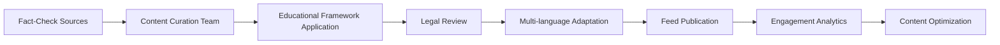

# TrustNet MVP Implementation Plan

**Based on Brainstorming Session Results - September 9, 2025**

## Executive Summary

This implementation plan translates the brainstorming session insights into a concrete development roadmap for TrustNet's MVP. The plan prioritizes user empowerment and educational value while maintaining technical feasibility within Google Cloud's ecosystem.

## Core MVP Features Implementation

### 🎯 Priority #1: Automated Verification Engine

#### Technical Implementation

**Data Sources for Cross-Referencing:**
- **Primary Sources**: Google Fact Check Tools API, Vertex AI Search index of trusted Indian sources
- **Secondary Sources**: Government health portals (MOHFW, AYUSH), RBI financial advisories, Election Commission statements
- **Regional Sources**: State government official channels, verified news outlets (PTI, ANI), academic institutions
- **Real-time Feeds**: WHO updates, SEBI alerts, PIB fact-checks

**API Endpoint Design:**
```javascript
POST /v1/verify
{
  "text": "वैक्सीन में माइक्रोचिप्स होती हैं",
  "language": "hi",
  "context": "health",
  "urgency": "normal"
}

Response:
{
  "verification_id": "uuid",
  "verification_card": {
    "credibility_score": 0.15,
    "rating": "False",
    "confidence": 0.92,
    "source_analysis": {
      "primary_sources_found": 3,
      "contradicting_evidence": 12,
      "supporting_evidence": 0
    },
    "alternative_headlines": [
      "COVID-19 vaccines contain mRNA, not microchips",
      "Vaccine ingredients are publicly available and documented"
    ],
    "neutral_summary": "The claim about microchips in vaccines has been extensively debunked by multiple health authorities. Vaccines contain documented medical ingredients designed to stimulate immune response."
  }
}
```

**UI Results Card Components:**
1. **Traffic Light System**: Green/Yellow/Red credibility indicator
2. **Source Counter**: "Checked against 15 trusted sources"
3. **Alternative Framing**: 2-3 neutral headline alternatives
4. **Quick Summary**: 50-word AI-generated neutral explanation
5. **Evidence Preview**: Top 2 contradicting/supporting source snippets
6. **Learn More Button**: Links to detailed evidence chain

#### Performance Requirements
- **Response Time**: <5 seconds for 95% of requests
- **Accuracy Target**: >85% alignment with expert fact-checkers
- **Language Support**: Hindi, English (MVP), expand to Bengali, Tamil, Telugu (Beta)

### 🏠 Priority #2: The Quarantine Room

#### AI Confidence Score Design

**Quarantine Trigger Conditions:**
- **Low Confidence**: AI confidence score <0.7
- **Conflicting Evidence**: Both supporting and contradicting sources found
- **Novel Claims**: No existing fact-check coverage found
- **High Manipulation Score**: Emotional/incentive manipulation detected >0.6
- **Synthetic Media Suspected**: AI-generated content probability >0.5

**Confidence Score Calculation:**
```python
def calculate_confidence_score(analysis_results):
    factors = {
        'source_agreement': 0.3,      # How much sources agree
        'evidence_quality': 0.25,     # Credibility of evidence sources  
        'claim_novelty': 0.2,         # How new/unprecedented the claim is
        'manipulation_clarity': 0.15, # How clear manipulation signals are
        'language_certainty': 0.1     # NLP model confidence
    }
    
    weighted_score = sum(analysis_results[factor] * weight 
                        for factor, weight in factors.items())
    return min(max(weighted_score, 0.0), 1.0)
```

#### Quarantine Room UI Design

**Page Components:**
1. **Content Preview**: Original claim with highlighted suspicious areas
2. **AI Uncertainty Explanation**: "I'm unsure because..." with specific reasons
3. **Evidence Comparison**: Side-by-side supporting vs. contradicting evidence
4. **Context Questions**: 3-4 questions to help user evaluate (e.g., "Does this source seem credible?")
5. **Similar Claims**: Related claims with known verdicts for comparison
6. **User Verdict Interface**: Simple "Legit" / "Misleading" / "Need More Info" buttons
7. **Reasoning Box**: Optional text field for user to explain their decision

**User Verdict Integration:**
```javascript
POST /v1/quarantine/{verification_id}/verdict
{
  "user_verdict": "misleading",
  "confidence": 4,
  "reasoning": "The source is a new website with no credentials, and the claim contradicts established medical consensus",
  "time_spent_seconds": 180
}
```

### 📚 Priority #3: Proactive Homepage Feed

#### Content Curation Process

**Ethical Framework for Real-World Examples:**
1. **Source Verification**: Only use claims already fact-checked by credible organizations
2. **Anonymization**: Remove personal identifiers from original claims
3. **Educational Purpose**: Frame all content as learning opportunities, not ridicule
4. **Balance**: Include both debunked and verified claims to show full spectrum
5. **Sensitivity**: Avoid graphic content, focus on teachable patterns
6. **Attribution**: Always credit fact-checking organizations and original reporters

**Legal Compliance:**
- **Fair Use**: Educational commentary and criticism exemption
- **Copyright**: Use only short excerpts with proper attribution
- **Privacy**: No personal social media posts without explicit consent
- **Defamation**: Focus on claim patterns, not individual accusation

#### Feed Content Categories

**Content Types:**
1. **Pattern Spotlights**: "This Week's Common Misinformation Tactic"
2. **Verification Walkthroughs**: Step-by-step fact-checking demonstrations  
3. **Source Spotlights**: "How to Identify Credible Health Information"
4. **Regional Focus**: India-specific misinformation patterns and cultural context
5. **Interactive Quizzes**: "Can You Spot the Red Flags?" engagement content

**Content Pipeline:**


#### Feed API Design

```javascript
GET /v1/feed?language=hi&category=health&limit=10

Response:
{
  "feed_items": [
    {
      "id": "uuid",
      "type": "debunked_example",
      "title": "स्वास्थ्य मंत्रालय की नकली सलाह कैसे पहचानें",
      "summary": "Recent fake health advisories and how to verify official communications",
      "learning_points": [
        "Check official domain names",
        "Look for government verification seals", 
        "Cross-reference with official social media"
      ],
      "engagement_score": 0.87,
      "published_at": "2025-09-08T10:00:00Z"
    }
  ],
  "trending_topics": ["health misinformation", "election rumors"],
  "educational_focus": "source verification techniques"
}
```

## Technical Architecture Enhancements

### Detection Principles Implementation

#### Emotional Manipulation Detection

**Linguistic Patterns (Hindi/English):**
```python
URGENCY_PATTERNS = {
    'hi': ['तुरंत', 'अभी', 'जल्दी करें', 'समय कम'],
    'en': ['urgent', 'immediately', 'act now', 'limited time']
}

FEAR_PATTERNS = {
    'hi': ['खतरा', 'डरावना', 'भयानक', 'चेतावनी'],
    'en': ['danger', 'warning', 'threat', 'beware', 'shocking']
}

def detect_emotional_manipulation(text, language='en'):
    urgency_score = count_pattern_matches(text, URGENCY_PATTERNS[language]) / 10
    fear_score = count_pattern_matches(text, FEAR_PATTERNS[language]) / 10
    
    return {
        'manipulation_score': min(urgency_score + fear_score, 1.0),
        'triggers_found': get_matched_patterns(text, language),
        'manipulation_type': classify_manipulation_type(urgency_score, fear_score)
    }
```

#### Unrealistic Incentives Detection

**Pattern Recognition:**
```regex
// Money-making claims
/earn (\$|₹|rs\.?)\s*\d+.*?(daily|hour|day|week)/gi

// Free money offers  
/(free|मुफ्त).*?(money|पैसा|cash|₹\d+)/gi

// Guaranteed returns
/(guaranteed|गारंटी).*?(profit|return|income|कमाई)/gi

// Work from home schemes
/(work from home|घर से काम).*?(\$|₹)\d+/gi
```

#### Technical Deception Detection

**URL Analysis Pipeline:**
1. **Shortener Detection**: Check against known URL shortening services
2. **Domain Age**: Query domain registration date via WHOIS
3. **SSL Certificate**: Validate certificate authority and expiration
4. **Typosquatting**: Compare against legitimate domain database
5. **Content Analysis**: Check if URL destination matches text description

### High Manipulation Alert System

#### Combined Alert Triggers

**Alert Conditions:**
```javascript
function shouldTriggerHighManipulationAlert(analysis) {
  const conditions = [
    // Emotional manipulation + Synthetic media
    analysis.emotional_score > 0.6 && analysis.synthetic_score > 0.5,
    
    // Unrealistic incentives + Technical deception
    analysis.incentive_score > 0.7 && analysis.deception_score > 0.5,
    
    // Multiple moderate scores
    countScoresAbove(analysis, 0.5) >= 3
  ];
  
  return conditions.some(condition => condition === true);
}
```

**Alert UI Components:**
- **Icon**: ⚠️ High Manipulation Warning badge
- **Summary**: "This content shows multiple manipulation tactics"
- **Breakdown**: List of specific techniques detected
- **Educational Link**: "Learn about these manipulation methods"

## Development Sprint Planning

### Sprint 1 (Weeks 1-2): Automated Verification Engine
**Tasks:**
- [ ] Set up Vertex AI Search index with initial Indian source corpus
- [ ] Implement basic verification API endpoint
- [ ] Create manipulation detection algorithms (emotional, incentive patterns)
- [ ] Build simple verification card UI component
- [ ] Integration with Google Fact Check Tools API

**Deliverables:**
- Working verification API with confidence scoring
- Basic web interface for testing
- Hindi/English language support

### Sprint 2 (Weeks 3-4): Quarantine Room
**Tasks:**
- [ ] Implement confidence score calculation algorithm  
- [ ] Design and build quarantine room UI
- [ ] Create user verdict submission system
- [ ] Implement feedback loop to analysis pipeline
- [ ] Add visual highlighting for suspicious content areas

**Deliverables:**
- Complete quarantine workflow
- User verdict data collection system
- Analytics for AI improvement

### Sprint 3 (Weeks 5-6): Proactive Homepage Feed
**Tasks:**
- [ ] Establish content curation pipeline
- [ ] Implement feed management system
- [ ] Create educational content templates
- [ ] Build engagement tracking system
- [ ] Develop trending analysis algorithm

**Deliverables:**
- Live educational feed with 50+ curated examples
- Engagement analytics dashboard
- Multi-category content organization

## Risk Mitigation Strategies

### Technical Risks

**AI Model Accuracy:**
- **Risk**: False positives damaging legitimate content
- **Mitigation**: Conservative confidence thresholds, human review for high-impact decisions
- **Monitoring**: Track false positive rates through user feedback

**Scalability:**
- **Risk**: Performance degradation under load
- **Mitigation**: Cloud Run auto-scaling, Redis caching for frequent queries
- **Testing**: Load testing with 10,000+ concurrent requests

### Ethical Considerations

**Content Sourcing:**
- **Challenge**: Using real misinformation examples ethically
- **Solution**: Partner with established fact-checking organizations for pre-verified content
- **Safeguards**: Legal review process, sensitivity guidelines, community feedback loop

**AI Bias:**
- **Challenge**: Detection algorithms may exhibit cultural or linguistic bias
- **Solution**: Diverse training data, regular bias audits, community input on false positives
- **Monitoring**: Track accuracy across different languages and demographic groups

## Success Metrics & KPIs

### User Engagement
- **Daily Active Users**: Target 1,000+ users by month 2
- **Quarantine Participation**: >60% of users complete verdict submission
- **Feed Engagement**: Average 3+ minutes per feed session
- **Return Rate**: >40% of users return within 7 days

### Educational Impact
- **Learning Assessment**: Pre/post quizzes showing improved detection skills
- **Behavior Change**: Users increasingly verify claims before sharing
- **Community Building**: User-generated content and discussions

### Technical Performance  
- **Accuracy**: >85% agreement with expert fact-checkers
- **Speed**: 95% of requests complete in <5 seconds
- **Availability**: 99.9% uptime with graceful degradation
- **Cost Efficiency**: <₹2 per verification request at scale

## Future Roadmap

### Phase 2 (Months 3-6): Enhanced Features
- **Misinformation Trends API**: Public API for researchers and journalists
- **Advanced Visual Analysis**: Image manipulation detection using computer vision
- **Community Moderation**: User reporting and collaborative fact-checking
- **Mobile Apps**: Native iOS/Android applications

### Phase 3 (Months 6-12): Scale & Impact
- **Regional Expansion**: Support for all major Indian languages
- **Partnership Integration**: APIs for news platforms and social media
- **Research Collaboration**: Academic partnerships for misinformation studies
- **Policy Impact**: Data insights for digital literacy policy recommendations

## Implementation Timeline

| Week | Focus Area | Key Deliverable |
|------|------------|----------------|
| 1-2 | Verification Engine | Working API + Basic UI |
| 3-4 | Quarantine Room | Complete user workflow |  
| 5-6 | Educational Feed | Live content platform |
| 7-8 | Integration & Testing | End-to-end system testing |
| 9-10 | Performance & Security | Production-ready deployment |
| 11-12 | Launch Preparation | User onboarding + documentation |

This implementation plan provides a concrete path from brainstorming insights to a functional MVP that empowers users while addressing the technical and ethical challenges of misinformation detection in India's complex digital landscape.
